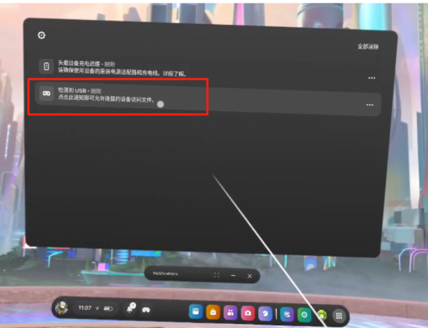

<div align="center">
  <h1 align="center"> quest_piper_with_gripper </h1>
</div>


## 介绍

该仓库实现了使用 meta quest2/3 VR 套装对 piper 机械臂进行遥操作,数据采集，数据处理，ACT训练及推理的数据闭环。

### 准备工作 

一、安装依赖

```bash
sudo apt install android-tools-adb

conda create -n vt python=3.9

conda activate vt

conda install pinocchio==3.2.0 casadi==3.6.7 -c conda-forge

pip install meshcat rospkg pyyaml pure-python-adb piper-sdk
```

二、开启开发者模式（必须步骤，否则无法安装第三方APK）

开始前请确认自己 quest 设备中是否有开发者模式，请参考如下步骤查找：

设置 → 高级 → 开发者 → 将 "启用开发者设置" 打开。

如果有，则跳过此步。

如果没有开发者选项，则参考下面步骤进行激活。

1、注册Meta开发者账号
→ 访问 Meta开发者平台，用Meta账号登录后创建组织（名称随意），绑定信用卡完成验证。

2、在手机App中开启开发者模式
→ 打开手机端 Meta Quest App → 设备设置 → 开发者模式 → 开启开关。

3、在头显中允许未知来源
→ 头显内进入 设置 → 系统 → 开发者选项 → 开启 "未知来源"权限。

三、设置头显休眠时长

需要将休眠时长设置最大，以免头显息屏导致无法输出位姿数据。

→ 头显内进入 设置 → 常规 → 电源 → 将"显示屏关闭时间" 调成 4 小时。

四、在头显中安装 APK 文件 2 种方法（有网络与无网络）

这里的有网络是指：国内用户需全程使用**稳定代理环境**（路由器代理/UU加速器/魔法热点），否则无法激活设备或访问Meta服务。

1、无网络环境（推荐）

- 建立连接：开启开发者模式后，用数据线连接Quest与电脑 → Quest弹出"允许USB调试"提示 → 授权后建立通道
- 命令行输入：

```bash
adb install 路径/teleop-debug.apk
```

等待一段时间后，终端输出 Success 即安装成功。

2、有稳定代理环境

- 在quest上安装`teleop-debug.apk`文件，文件在`questVR_ws-master/src/oculus_reader/APK`目录下。

  - [步骤1] 到meta商店安装Mobile VR Station 应用(联网)

  - [步骤2] 将 quest 与 pc 相连，开启 USB调试，在 pc 上显示新设备接入后，把要上述 apk 文件下载并复制到 quest的 Dowanload 目录里面

  - [步骤3] 开启Mobile VR Station => Configuration Wizard => Show All Options => Configuration Scoped Storage => Step1: Request Access => 选择根目录Dowanload 里面刚刚步骤2放的apk 点击类似放大的按钮会弹出一个窗口，在弹出的窗口里点击安装
- 如果上一步无法安装可以用如下链接中的方案，注意需要windows
  - <https://www.bilibili.com/opus/267781439861047911>
  - 其中的SideQuest app界面会更新，但是一定会有安装apk功能 <https://github.com/SideQuestVR/SideQuest/releases>


3、将代码克隆下来并编译：

```bash
git clone git@github.com:agilexrobotics/questVR_ws-master.git

cd questVR_ws-master 

catkin_make
```

我们在 Ubuntu 20.04 上测试了我们的代码，其他操作系统可能需要不同的配置。

有关更多信息，您可以参考 [開始使用 Meta Quest 2](https://www.meta.com/zh-tw/help/quest/articles/getting-started/getting-started-with-quest-2/?srsltid=AfmBOoqvDcwTtPt2P9o6y3qdXT_9zxz4m8yyej4uwLGEXV##
        <mesh
          filename="/home/agilex/questVR_ws-master/src/Piper_ros/src/piper_description/meshes/base_link.STL" />
</geometry>

修改成

<geometry>
        <mesh
          filename="/home/<your name>/questVR_ws-master/src/Piper_ros/src/piper_description/meshes/base_link.STL" />
</geometry>
```


## 软件启动 [此部分为单纯遥操，不包括采集，采集见下面数据闭环]

1、机械臂使能

**单piper使能**：

将机械臂的can线接入电脑

然后执行：
### 独立终端
```bash
cd ~/pika_ros/scripts/ && bash start_single_gripper.bash #打开夹爪ros，后面集成上
```

### 启动遥操机械臂
```bash
cd ~/questVR_ws-master/src/Piper_ros

bash can_activate.sh can0 1000000

source /home/synk/questVR_ws-master/devel/setup.bash

conda activate vt

roslaunch oculus_reader teleop_single_piper.launch # 单臂遥操

```

在启动遥操代码时出现该错误时：

```bash
Device not found. Make sure that device is running and is connected over USB
Run `adb devices` to verify that the device is visible.
```

说明了VR头盔未开启调试模式，开启调试模式方法步骤如下：

1. 使用 USB-C 线将VR头盔连接到计算机，然后佩戴该设备。

2. 当在通知中出现“检测到USB”，点击一下该通知。

   

3. 第一次开启程序，会出现上面的报错。

4. 当设备上出现提示时，接受**允许 USB 调试**和**始终允许从此计算机进行。**

   

5. 关掉程序，再次运行。


## 操作说明

> 注意⚠️：
>
> - 请一定要确保VR屏幕保持常亮，否则TF会乱飘导致遥操作机械臂乱飞，我们建议在VR眼镜里面拿东西遮住感应器，使其保持常亮状态。
> - 开启程序后，请一定要确保手柄在VR视野里以及rviz里面的坐标稳定不会乱飘，然后按住按键“A”||“X”使机械臂复位，复位后才可进行遥操做，否则机械臂也会乱飞。
> - 在遥操 piper 启动后，请注意观察网页端的机械臂是否乱飘，

- 遥操单臂使用右手手柄，开始遥操前确保机械臂回到初始姿态，按住按键 “A” 能使机械臂回到初始位置，长按按键 “B” 为遥操机械臂，松开为停止控制。遥操双臂同理。  

- 为了操作的人身安全以及减少对机械臂的损害，在遥操结束后，请确保机械臂回到初始位置附件再按下“A”||“X”键复位。

# 数据闭环
## 数据采集
###  夹爪话题发布
```bash
cd ~/questVR_ws-master/src/pika_ros/scripts/ && bash start_single_gripper.bash 
#另起终端，手动开启一次,打开夹爪ros 
```

###  启动遥操机械臂
 
```bash
cd ~/questVR_ws-master/src/Piper_ros && bash can_activate.sh can0 1000000

source /home/synk/questVR_ws-master/devel/setup.bash 【已经写入bash】

conda activate vt

roslaunch oculus_reader teleop_single_piper.launch    # 单臂遥操

```
说明
（1）采集后按下A进行复位后，不要移动手柄位置，按住B键进行采集
（2）手柄前侧的扳机键按下为控制夹爪力度【若采集刚性物体，需要修改代码，控制夹爪最小距离，防止夹爪夹爆】
（3）每次按下A键进行一次采集流程，默认为10s，请在进度条结束前完成采集

###  采集数据 【已经集成到遥操】
```bash
roslaunch data_tools run_data_capture.launch type:=single_piper_with_gripper datasetDir:=/home/synk/questVR_ws-master/src/data_collect episodeIndex:=5
```

###  数据同步
```bash
roslaunch data_tools run_data_sync.launch type:=single_piper_with_gripper datasetDir:=/home/synk/questVR_ws-master/src/data_collect/bear_v4 episodeIndex:=0
```
说明
（1）若为-1则同步datasetDir目录下的所有数据组。
（2）同步完成之后，将在每个特定数据路径中生成一个sync.txt文件。例如，图像数据同步索引文件路径：/home/agilex/data/episode0/camera/color/pikaDepthCamera/sync.txt。
（3）sync.txt文件说明：
以pikaDepthCamera的RGB数据为例子，其sync.txt文件如下所示。其中包含了文件名，各个传感器同步后的sync.txt行数一致，为同步后的结果。

## 数据处理
### 转化为hdf5 -> 用来ACT训练 --base_dir 后接用来转化为hdf5的文件夹
python /home/synk/questVR_ws-master/src/data_process/pika_save_hdf5_all.py --base_dir /home/synk/questVR_ws-master/src/data_collect/bear_v4

[下面是分开转化的]
```bash
python /home/synk/questVR_ws-master/src/data_process/pika_save_hdf5.py \
--datasetDir "/home/synk/questVR_ws-master/src/data_collect/bear_v3" \
--episodeIndex 48 \
--cameraColorNames "pikaGripperDepthCameraColor,pikaGripperFisheyeCamera" \
--cameraDepthNames "pikaGripperDepthCameraDepth" \
--cameraPointCloudNames "" \
--useCameraPointCloud False \
--useCameraPointCloudNormalization False \
--localizationPoseNames "master" \
--gripperEncoderNames "pikaGripper"
```

## 数据重播
###  数据重播 - pika_sdk
```bash
conda activate FlexUMI


cd ~/pika_ros/scripts/ && bash start_single_gripper.bash

cd ~/questVR_ws-master/src/Piper_ros && bash can_activate.sh can0 1000000

cd /home/synk/questVR_ws-master/ && python -m src.data_process.pika_replay_action.py --input file /home/synk/questVR_ws-master/src/act_input/bear_v4/episode_0.hdf5
```
[重播会导致机械臂莫名其妙失能]

## 数据训练
###  整合hdf5文件
```bash
 
python /home/synk/questVR_ws-master/src/data_process/organize_hdf5_files.py
```
###  ACT训练 [要改constants]
```bash
 
python3 /home/synk/questVR_ws-master/src/data_policies/act/train.py \
--task_name bear \
--ckpt_dir /home/synk/questVR_ws-master/src/act_output/ckpt/bear_v3 \
--policy_class ACT --kl_weight 10 --chunk_size 20 \
--hidden_dim 512 --batch_size 8 --dim_feedforward 3200 \
--num_epochs 10000 --lr 1e-5 --seed 0
```

## 数据推理
###  ACT部署 使用训练时的相同参数--temporal_agg 为启用 temporal ensembling --num_rollout 为运行轮次
```bash
 
cd ~/pika_ros/scripts/ && bash start_single_gripper.bash 

cd ~/questVR_ws-master/src/Piper_ros && bash can_activate.sh can0 1000000

conda activate FlexUMI &&
python3 /home/synk/questVR_ws-master/src/data_policies/act/pika_infer_real.py \
--task_name bear \
--ckpt_dir /home/synk/questVR_ws-master/src/act_output/ckpt/bear_v3 \
--policy_class ACT --kl_weight 10 --chunk_size 20 \
--hidden_dim 512 --batch_size 8 --dim_feedforward 3200 \
--num_epochs 1000 --lr 1e-5 --seed 0 \
--temporal_agg
```

###  失能夹爪
```bash
 
rostopic pub /gripper/ctrl data_msgs/Gripper "header:
  seq: 0
  stamp: now
  frame_id: ''
angle: 0
distance: 0.0
effort: 0.0
velocity: 0.0
enable: false
set_zero: false
error: false
voltage: '0.0'
driver_temp: '0.0'
motor_temp: '0.0'
status: '0'
bus_current: '0.0'"

rostopic pub /gripper/ctrl data_msgs/Gripper "header:
  seq: 0
  stamp: now
  frame_id: ''
angle: 1.5
distance: 0.0
effort: 0.0
velocity: 0.0
enable: true
set_zero: false
error: false
voltage: '0.0'
driver_temp: '0.0'
motor_temp: '0.0'
status: '0'
bus_current: '0.0'"

```
### 注意的点
1. 机械臂下面亮红点，是航空插头上面那个插头没插稳的原因
2. 不能把手柄放下面去了，不然机械臂就飘了
3. 按完A后不要动手柄，直接按B，否则机械臂会抽搐
4. 机械臂长时间使能电机会发烫，建议不用的时候把关了
5. 修改datacapture等cpp文件，要重新catkin

#### 进入工作空间
cd ~/questVR_ws-master && catkin_make
 
